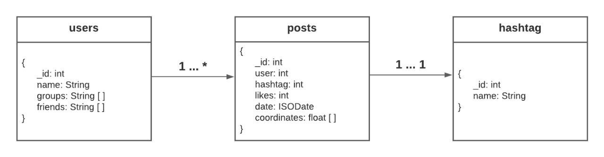

# Actividad 2. Bases de datos de documentos

### Equipo 5

- [Daniela Vignau León (A01021698)](https://github.com/dvigleo)
- [Cristopher Alan Cejudo Machuca (A01025468)](https://github.com/ccejudo)
- [Héctor Alexis Reyes Manrique (A01339607)](https://github.com/hreyesm)

## Contenido

  - [Descripción del problema](#descripción-del-problema)
  - [Definición de la base de datos](#definición-de-la-base-de-datos)
  - [Configuración y uso](#configuración-y-uso)
  - [Consultas](#consultas)
    - [`unwind`](#unwind)
    - [`lookup`](#lookup)
    - [`graphLookup`](#graphlookup)
    - [`geoNear`](#geonear)
    - [`facet`](#facet)

## Descripción del problema

Para esta actividad, se modeló una base de datos en el contexto de una plataforma de redes sociales similar a Facebook o Twitter. La base de datos fue implementada con el DBMS no relacional MongoDB. Se programó un script en Python para poblar las tres colecciones que comprenden la base de datos (_users_, _posts_ y _hashtag_), con 100,000 documentos por colección. Por último, se desarrolló un ejecutable que permite visualizar, mediante pipelines definidos a partir del _Aggregation Framework_ de MongoDB, cinco consultas analíticas a la base de datos implementada.

## Definición de la base de datos

El patrón de modelado por el que se optó para diseñar la base de datos es de tipo referencial. A continuación se muestra un diagrama del esquema de la base de datos:

<p align=center></p>

Al tratarse de tres colecciones distintas, la entidad _posts_ actúa como vínculo entre las colecciones _users_ y _hashtag_.

## Configuración y uso

1. Clonar el repositorio `https://github.com/tec-csf/tc3041-actividad-2-invierno-2021-eq5`
2. Ejecutar el comando `pip install -r requirements.txt`
3. Crear un archivo `.env` y almacenar la cadena de conección SRV del clúster en una variable llamada `mongo_url`
4. Ejecutar el comando `python3 populate_database.py` para crear la base de datos y poblar sus colecciones
5. Ejecutar el comando `python3 main.py` para correr el programa principal y ejecutar las consultas

## Consultas

### `unwind`

**Descripción**

Obtener, en orden descendente, la cantidad de personas de nombre "Murphy" que están inscritas por grupo.

**Pipeline**

```json
[
  { "$match": { "name": "Murphy" } },
  { "$unwind": { "path": "$groups" } },
  { "$group": { "_id": "$groups", "enrolled": { "$sum": 1 } } },
  { "$sort": { "enrolled": -1 } }
]
```

**Etapas**

- `match`: Filtra los documentos por el nombre "Murphy"
- `unwind`: Descompone los documentos obtenidos bajo el criterio "groups"
- `group`: Cuenta el número de personas con el nombre "Murphy" que pertecen a cada uno de los grupos
- `sort`: Ordena los resultados de manera descendente

### `lookup`

**Descripción**

Obtener el promedio de likes de los 10 posts con más likes asociados con el hashtag "semper".

**Pipeline**

```json
[
  {
    "$lookup": {
      "from": "hashtags",
      "localField": "hashtag",
      "foreignField": "_id",
      "as": "hashtagInfo"
    }
  },
  {
    "$replaceRoot": {
      "newRoot": {
        "$mergeObjects": [{ "$arrayElemAt": ["$hashtagInfo", 0] }, "$$ROOT"]
      }
    }
  },
  { "$match": { "name": "semper" } },
  { "$sort": { "likes": -1 } },
  { "$limit": 10 },
  { "$group": { "_id": "$name", "averageLikes": { "$avg": "$likes" } } },
  { "$project": { "_id": 0, "averageLikes": 1 } }
]
```

**Etapas**

- `lookup`: Produce la unión de las colecciones "posts" y "hashtags"
- `replaceRoot`: Extrae el contenido del atributo "hashtagInfo" y lo coloca al mismo nivel de los atributos exteriores
- `match`: Filtra los documentos por el nombre "semper"
- `sort`: Ordena los documentos de mayor a menor número de likes
- `limit`: Limita los resultados a 10
- `group`: Obtiene el promedio de likes
- `project`: Muestra únicamente el atributo "averageLikes"

### `graphLookup`

**Descripción**

Obtener el número total de likes de los posts cuyo autor sea amigo mutuo del usuario con email "quis.diam.luctus@ultricies.net" con mayor número de likes acumulados entre sus posts.

**Pipeline**

```json
[
  { "$match": { "email": "quis.diam.luctus@ultricies.net" } },
  {
    "$graphLookup": {
      "from": "users",
      "startWith": "$friends",
      "connectFromField": "friends",
      "connectToField": "name",
      "as": "ITCs",
      "maxDepth": 2,
      "restrictSearchWithMatch": { "groups": "ITC", "friends": "Marah" }
    }
  },
  { "$project": { "connections": "$ITCs._id" } },
  { "$unwind": { "path": "$connections" } },
  {
    "$lookup": {
      "from": "posts",
      "localField": "connections",
      "foreignField": "user",
      "as": "postInfo"
    }
  },
  { "$sort": { "postInfo.likes": -1 } },
  { "$limit": 1 },
  { "$unwind": { "path": "$postInfo" } },
  { "$group": { "_id": None, "totalLikes": { "$sum": "$postInfo.likes" } } },
  { "$project": { "_id": 0 } }
]
```

**Etapas**

- `match`: Filtra los documentos a partir del correo electrónico "quis.diam.luctus@ultricies.net"
- `graphLookup`: Recopila los amigos del dueño del correo electrónico especificado que pertenecen al grupo ITC y que, además, tienen como amigo al dueño del correo electrónico ("Marah")
- `project`: Obtiene el ID de los amigos anteriormente encontrados
- `unwind`: Descompone los documentos bajo el criterio "connections"
- `lookup`: Realiza la unión de las colecciones "users" y "posts"
- `sort`: Ordena de manera descencente los resultados obtenidos
- `limit`: Limita los resultados a 1 para obtener el documento con mayor número de likes
- unwind: Descompone el documento a partir del criterio "postInfo"
- `group`: Realiza la suma total de likes
- `project`: Muestra únicamente la suma

### `geoNear`

**Descripción**

Obtener la distancia promedio que existe a partir de la coordenada [-77.73, -5.71] tomando como referencia los 56 posts con mayor distancia del punto original cuya fecha de publicación está entre "2021-01-01" y "2020-06-01" y que tienen más de 950 likes.

**Pipeline**

```json
[
  {
    "$geoNear": {
      "near": { "type": "Point", "coordinates": [-77.73, -5.71] },
      "distanceField": "distance"
    }
  },
  {
    "$match": {
      "date": {
        "$lt": ISODate(2021-01-01),
        "$gte": ISODate(2020-06-01)
      },
      "likes": { "$gt": 950 }
    }
  },
  { "$sort": { "distance": 1 } },
  { "$skip": 50 },
  {
    "$group": { "_id": "distance", "averageDistance": { "$avg": "$distance" } }
  },
  { "$project": { "_id": 0, "averageDistance": 1 } }
]
```

**Etapas**

- `geoNear`: Encuentra la distancia que existe a partir del punto [-77.73, -5.71] con el resto de los documentos en la colección "posts"
- `match`: Filtra los documentos por fecha de publicación (2021-01-01 y 2020-06-01) y por aquellos que tengan más de 950 likes
- `sort`: Ordena los documentos de manera ascendente
- `skip`: En este momento, existen 106 documentos, por lo que se descartan los primeros 50 y se conservan los 56 restantes
- `group`: Computar la distancia promedio en los 50 posts restantes
- `project`: Muestra únicamente la distancia obtenida

### `facet`

**Descripción**

Obtener para los usuarios con dominios de correo "@elitpretium.edu", "@Nullamsuscipit.edu" y "@eu.net" la siguiente información:

1. Categorización por likes de los posts de los usuarios del grupo "ITC" (4 grupos)
2. Categorización por likes de los posts de los usuarios del grupo "SATI" (5 grupos) 
3. Posts del grupo "Lost & Found" publicados después de la fecha "2020-01-01"
4. Posts del grupo "Becarios" ordenado de manera descendente por número de likes

**Pipeline**

```json
[
  {
    "$match": {
      "$or": [
        { "email": { "$regex": ".+@elitpretium.edu" } },
        { "email": { "$regex": ".+@Nullamsuscipit.edu" } },
        { "email": { "$regex": ".+@eu.net" } }
      ]
    }
  },
  {
    "$lookup": {
      "from": "posts",
      "localField": "_id",
      "foreignField": "user",
      "as": "post"
    }
  },
  {
    "$unwind": { "path": "$groups" }
  },
  {
    "$facet": {
      "group-ITC": [
        { "$match": { "groups": "ITC" } },
        { "$unwind": { "path": "$post" } },
        {
          "$bucketAuto": {
            "groupBy": "$post.likes",
            "buckets": 4
          }
        }
      ],
      "group-SATI": [
        { "$match": { "groups": "SATI" } },
        { "$unwind": { "path": "$post" } },
        {
          "$bucketAuto": {
            "groupBy": "$post.likes",
            "buckets": 5
          }
        }
      ],
      "group-Lost&Found": [
        { "$match": { "groups": "Lost & Found" } },
        { "$unwind": { "path": "$post" } },
        { "$match": { "post.date": { "$gte": ISODate(2020-01-01) } } }
      ],
      "group-Becarios": [
        { "$match": { "groups": "Becarios" } },
        { "$unwind": { "path": "$post" } },
        { "$sort": { "post.likes": -1 } }
      ]
    }
  }
]
```

**Etapas**

- `match`: Encuentra los usuarios con los dominios de correos indicados, haciendo uso de expresiones regulares
- `lookup`: Realiza la unión de usuarios con sus respectivos posts
- `unwind`: Separa los usuarios con los grupos a los que pertecen respectivamente
- `facet`: Realiza un pipeline para cada uno de los 4 requerimientos
  - **group-ITC**: Agrupa a los usuarios que pertecen al grupo "ITC" y realiza una categorización de 4 grupos según el número de likes de todos los posts
  - **group-SATI**: Agrupa a los usuarios que pertecen al grupo "SATI" y realiza una categorización de 5 grupos según el número de likes de todos los posts
  - **group-Lost&Found**: Agrupa a los usuarios que pertecen al grupo "Lost & Found" y muestra únicamente los posts publicados después de la fecha "2020-01-01"
  - **group-Becarios**: Agrupa a los usuarios que pertecen al grupo "Becarios" y ordena todos los posts de manera descendente según el número de likes
